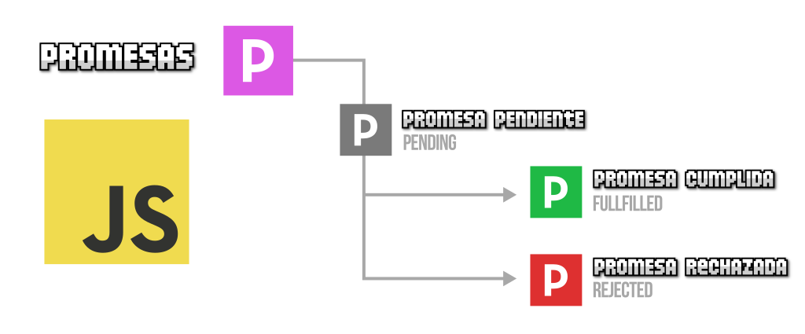

# Introducción a la Asincronía: Operaciones Asíncronas

## ¿Qué es la Asincronía?

> La asincronía es la **capacidad de ejecutar tareas sin bloquear el flujo principal del programa** mientras se espera un resultado que puede tardar (por ejemplo: pedir datos a una API, leer un archivo, esperar una animación o temporizador).
> 

### **Operación Asíncrona : Palabra clave “segundo plano”**

> Una **operación asincrónica** es una tarea que **no se ejecuta inmediatamente**, y **su resultado llega después**, sin detener el resto del programa.
> 

<aside>

**Analogía simple:**

Imagina que estás cocinando y metes una pizza al horno.

¿Te quedas mirando el horno los 20 minutos completos? No, ¿cierto?

Mientras la pizza se cocina (🕒 tarea asincrónica), **tú sigues preparando la ensalada** o poniendo la mesa (tareas síncronas).

**Eso es asincronía**: la tarea se “ejecuta en segundo plano”, y tú no te quedas bloqueado esperando a que termine.

</aside>

- En lugar de esperar a que una tarea termine para seguir con la siguiente, JavaScript sigue ejecutando el resto del código y vuelve a esa operación asíncrona cuando esté lista.



## JavaScript es Single-Thread (un solo hilo)

> JavaScript **ejecuta el código línea por línea** en un solo hilo (es decir, **una cosa a la vez**). 
Si una tarea tarda mucho, **bloquea todo lo demás**... por eso necesitamos la asincronía.
> 

**Ejemplo de tarea bloqueante (sincrónica):**

```jsx
while (true) {
  // bloquea todo el programa
}
```

## ¿Por qué es importante la asincronía?

> Porque **JavaScript solo tiene un único hilo de ejecución** (single-thread), y **si algo toma mucho tiempo y es síncrono, congela todo lo demás** (incluyendo la UI del navegador).
> 
- Por eso existen las promesas y los mecanismos asincrónicos: **para mantener la fluidez de la aplicación sin bloquear el flujo del programa**.

| Razón | Explicación breve |
| --- | --- |
| ✅ Mejora el rendimiento | Permite realizar otras tareas mientras se espera el resultado. |
| 📱 Experiencia de usuario | Evita que la interfaz se congele o bloquee. |
| 🌐 Operaciones lentas | Ideal para trabajar con APIs, archivos, bases de datos, timers, etc. |
| 🔄 Código reactivo | Permite reaccionar cuando algo termine (sin bloquear el flujo). |

## Ejemplos de tareas asincrónicas comunes

| Tarea | ¿Por qué es asincrónica? |
| --- | --- |
| `fetch()` (peticiones HTTP) | Puede tardar segundos dependiendo del servidor. |
| `setTimeout()` y `setInterval()` | Ejecutan algo después de un tiempo. |
| Acceso a base de datos | Lectura o escritura puede demorar. |
| Animaciones y eventos del DOM | Esperan una acción del usuario o del sistema. |

## ¿Cómo se maneja la asincronía en JavaScript?

> JavaScript ofrece **tres formas principales** para trabajar con asincronía:
> 

| Técnica | Descripción breve |
| --- | --- |
| ✅ **Callbacks** | Funciones que se pasan como argumento y se ejecutan después de que termine una tarea. |
| ✅ **Promises** | Objetos que representan el resultado futuro de una operación. |
| ✅ **Async/Await** | Sintaxis moderna para escribir código asincrónico como si fuera sincrónico. |